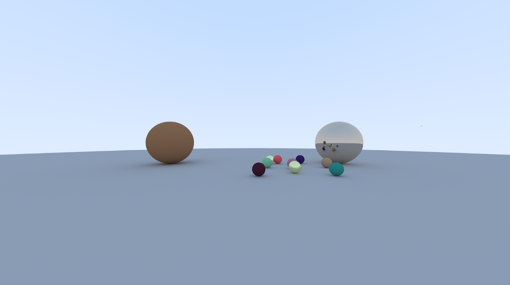
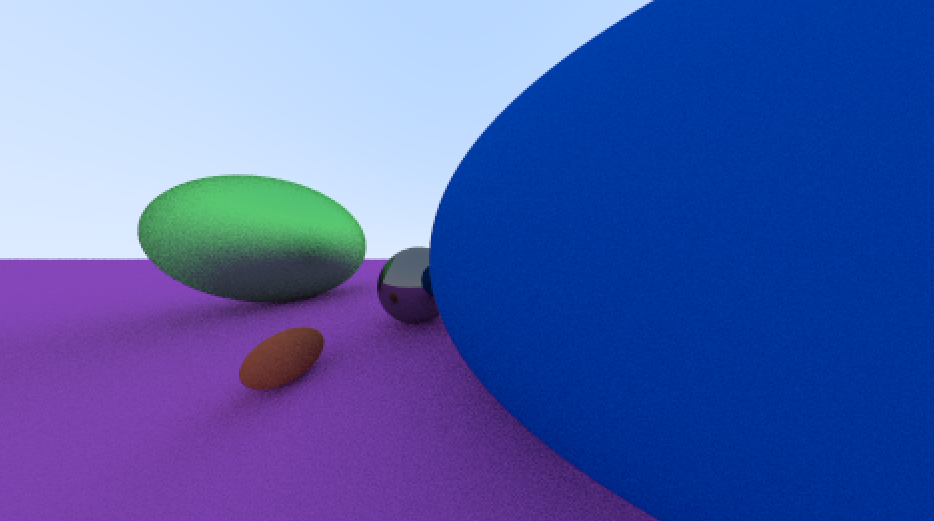
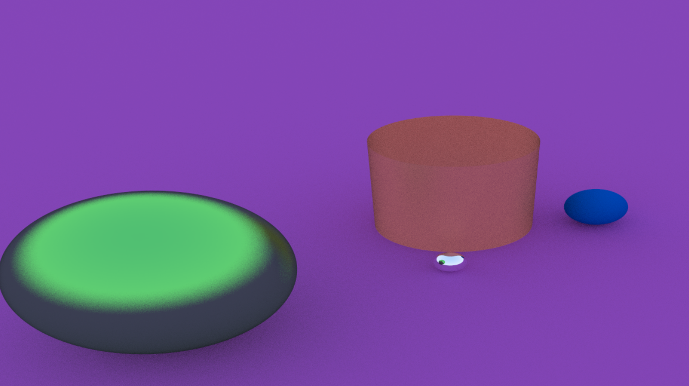

```
                               
                _____        __     _________ _____            _____ ______ _____  
                |  __ \     /\\ \   / /__   __|  __ \     /\   / ____|  ____|  __ \ 
                | |__) |   /  \\ \_/ /   | |  | |__) |   /  \ | |    | |__  | |__) |
                |  _  /   / /\ \\   /    | |  |  _  /   / /\ \| |    |  __| |  _  / 
                | | \ \  / ____ \| |     | |  | | \ \  / ____ \ |____| |____| | \ \ 
                |_|  \_\/_/    \_\_|     |_|  |_|  \_\/_/    \_\_____|______|_|  \_\
                                                
```

## Epitech 2023 🎓

This project is a part of the **second** year of Epitech. <br>
We had **3 weeks** to complete it. :spiral_calendar: <br>

The goal of this project is to create a raytracer in C++. <br>
Ray tracing is a **technique** used to **generate realistic digital images** by simulating the **inverse path of light**. <br>
It means we had to be able to create a program able to **generate an image** in a ppm format from a **file describing the scene**. <br>

## How to compile

Getting the source code straight from GitHub? Compile using these steps below

```bash
$ git clone https://github.com/EpitechPromo2026/B-OOP-400-BDX-4-1-raytracer-melissa.laget.git Raytracer
$ cd Raytracer
$ mkdir -p build/ && cd build/
$ cmake .. && make -j
$ cd ..
$ ./Raytracer ./doc/example_config.cfg
```

## Usage
```bash
# Explains how to use the raytracer program
$ ./raytracer -h

# Launch the program with a scene config
$ ./raytracer (config.cfg)
```

## Example outputs:

 
 
 

## Commit norms
[See Commit norm](doc/COMMIT.md)

## Tools used: 🛠️

[](https://github.com/tandpfun/skill-icons)

## Download

You can download the latest release [here](https://github.com/EpitechPromo2026/B-OOP-400-BDX-4-1-raytracer-melissa.laget/releases/latest)
